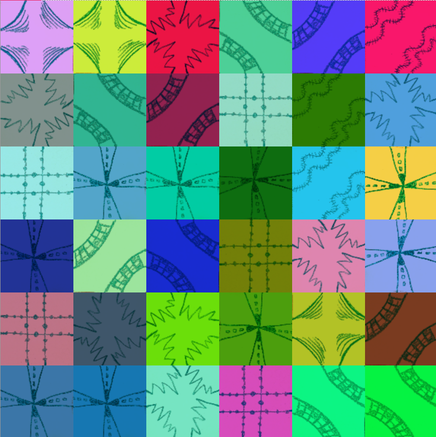

# week8_quiz_wzho0193

## Part 1: Imaging Technique Inspiration
**POP ART** is an iconic art movement known for its vibrant colors and bold compositions, often featuring famous figures and everyday objects. The example you shared, reminiscent of Andy Warhol’s works, is visually striking due to its repetitive, vibrant imagery.

The aspect of **Pop Art** I’d like to incorporate into my project is the **use of bold, contrasting colors and repetition of elements**. This can align with the assignment requirements of creating an engaging and dynamic visual. Pop Art’s emphasis on mass production and repetition mirrors the structure of **Truchet tiles**, which allow for various configurations while maintaining a cohesive design. By using **vibrant colors**, the artwork would stand out and create a visually compelling experience.

[Link Pop Art](https://pixel77.com/art-history-pop-art-motifs/)

**Image**


## Part 2: Coding Technique Exploration

The coding technique I'd like to explore for implementing **Truchet tiles** involves using a grid-based approach, where each tile can rotate and interlock with others. By loading various images and applying random rotations (0°, 90°, 180°, 270°), the tiles will create an interesting pattern that mirrors the **modular, repetitive nature of Pop Art**.

**The code I’ve found can help implement this technique by:**
- Using **random()** to generate different rotations.
- Applying **tint()** to dynamically **change colors, adding variety and mimicking the vibrant**, contrasting colors of Pop Art.

[Link Truchet tiles](https://happycoding.io/tutorials/p5js/images/truchet-tiles)      
[Link Code](https://editor.p5js.org/KevinWorkman/sketches/7PvZ_jOrO)

**Image**



**Reference Code**

```js
let images = [];

const squareSize = 100;

function preload() {
  images.push(loadImage('image-7.jpg'));
  images.push(loadImage('image-8.jpg'));
  images.push(loadImage('image-9.jpg'));
  images.push(loadImage('image-10.jpg'));
  images.push(loadImage('image-11.jpg'));
  images.push(loadImage('image-12.jpg'));  
}

function setup() {
  createCanvas(600, 600);
  
  imageMode(CENTER);
  
  for (const img of images) {
    img.resize(squareSize, squareSize);
  }
  
  background(32);
  
  frameRate(10);
}

function draw() {
  const x = squareSize / 2 + squareSize * floor(random(width / squareSize));
  const y = squareSize / 2 + squareSize * floor(random(height / squareSize));
  
  translate(x, y);
  
  const r = (PI / 2) * random([0, 1, 2, 3]);
  
  rotate(r);
  
  let redColor;
  let greenColor;
  let blueColor;
  
  do {
    redColor = random(255);
    greenColor = random(255);
    blueColor = random(255);
  } while(redColor < 100 && greenColor < 100 && blueColor < 100);
  
  tint(redColor, greenColor, blueColor);
  image(random(images), 0, 0);
}
```